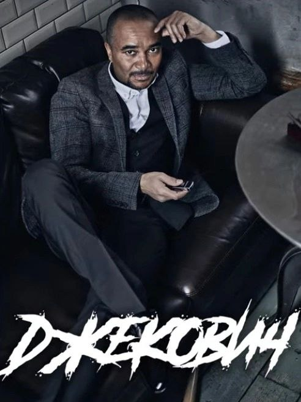

# BlackJackovich

## Базовые требования
- Функционал
    - Игра против бота, игра против другого человека
    - Возможность делать ставки
    - Аутентификация
- Архитектура
    - Клиент-сервер
- GUI
    - Простой UI

## Планирование с заказчиком:
- Уточнение требований, согласование правил
- 4 итерации
    - базовый бэкенд (игра с ботом)
    - базовый фронтенд
    - возможность PVP
    - рефакторинг и улучшения UI/кода
- Сценарии тестов для первой итерации
## Техническое планирование:
- Архитектура сервера
- Игровые сущности

## Итоги первой итерации
- Тесты для первой итерации
- Бэкенд на основе тестов и требований

## Второе планирование
- Выделение дополнительных ресурсов на фронтенд и передача этой задачи в отдельную команду
- Приоритет на разработку бекенда
    - Авторизация и аутентификация
    - Подключение базы данных
    - Рефакторинг методов, с целью подержки нового функционала
    
## Итоги рефакторинга и второй итерации
- Добавлена аутенфикация и авторизация пользователей
- Добавлена база данных пользователей и токенов
- Добавлен базовый фронтенд
- Добавлено лого проекта
- Рефакторинг проекта под новую функциональность